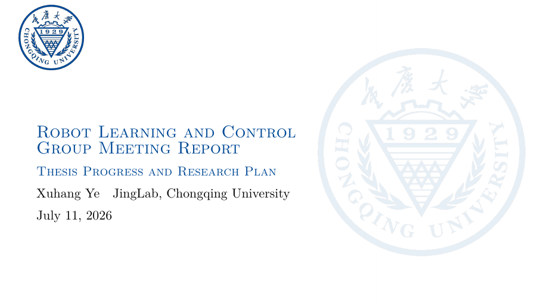
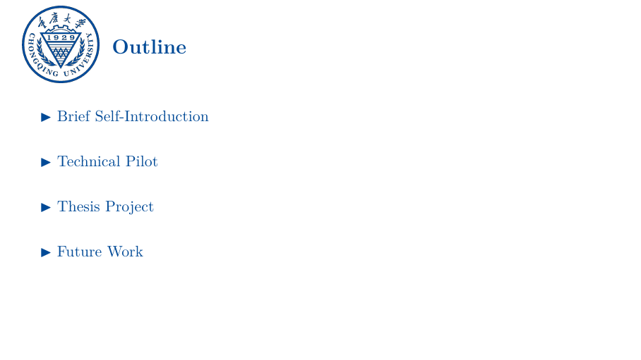
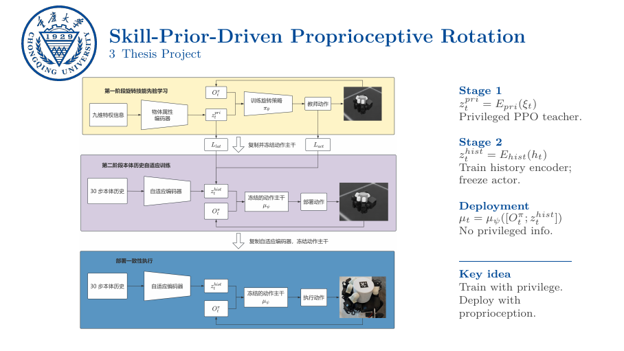
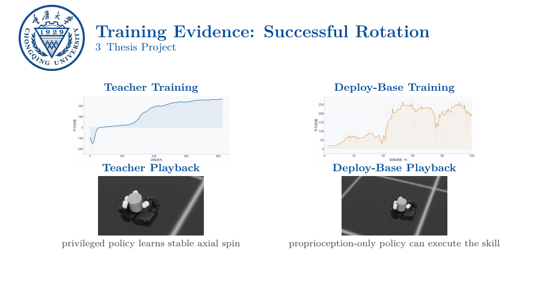
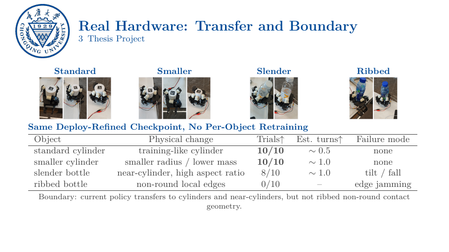
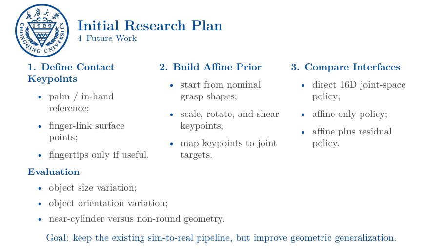

# 日常汇报 Beamer 模板

本模板用于组会汇报、课程展示、项目周报、阶段性答辩和短篇技术分享。它基于 XeLaTeX 与 Beamer，默认采用 16:9 重庆大学主题，并提供一份完整的机器人学习组会报告作为示例，覆盖封面、目录、章节导航、公式、方法框架、训练曲线、实验表格、真机结果和后续计划等常见页面。

模板参考 [Gua927/Latex_Template](https://github.com/Gua927/Latex_Template) 中的 Beamer 主题整理融入本仓库；源码许可证说明见 `LICENSE.source`。

## 目录结构

```text
daily-presentation/
├── main.tex
├── main.pdf
├── collegeBeamer.sty
├── assets/
│   ├── figures/
│   ├── videos/
│   └── screenshots/
├── src/
│   └── CQU/
│       ├── background.png
│       ├── color-logo.png
│       └── trans-logo.png
└── LICENSE.source
```

## 使用方式

```bash
cd templates/daily-presentation
latexmk -xelatex main.tex
```

建议先修改 `main.tex` 顶部集中维护的汇报信息：

```latex
\newcommand{\PresenterName}{Xuhang Ye}
\newcommand{\PresenterSchool}{JingLab, Chongqing University}
\newcommand{\PresentationTopic}{Robot Learning and Control\\Group Meeting Report}
\newcommand{\PresentationSubtitle}{Thesis Progress and Research Plan}
```

长标题可使用 `\\` 控制封面换行；同时建议保留 `\title[...]` 中的单行短标题，用于 PDF 元数据和导航。随后按 `\section` 与 `frame` 替换示例内容即可。

## 模板能力

- 16:9 Beamer 页面，适合常见会议室屏幕和在线分享。
- 重庆大学主题封面、校徽、主色、页眉与章节导航。
- 自动生成目录，并在进入新章节时高亮当前章节。
- 支持双栏、多栏、公式、表格、图片、代码块和强调色文本。
- 支持将关键帧图片链接到本地视频，适合展示仿真与真机实验。
- 提供中英文选项；中文内容使用 XeLaTeX，并按需加载 `xeCJK`。

## 效果展示

### 封面



### 内容总览



### 核心方法



### 训练过程与结果



### 真机迁移与实验边界



### 后续研究计划



## 主要特色

### 集中维护汇报信息

姓名、单位、主题和副标题集中放在 `main.tex` 顶部。复用模板时不需要进入样式文件寻找封面字段，适合频繁更新的组会和周报。

### 自动章节导航

使用 `\section{}` 划分汇报结构后，模板会自动生成总目录，并在每个章节开始前插入当前章节高亮页。正文页标题下方也会显示章节编号与名称，便于长汇报定位。

### 面向技术汇报的页面组件

示例内容包含任务定义、策略接口、奖励函数、训练流程、方法框架、定量表格、消融实验、真机对比和研究计划，可直接作为科研与工程汇报的页面组织参考。

### 图片与视频配套展示

`assets/figures/` 保存静态图和视频预览帧，`assets/videos/` 保存原始演示。示例通过 `\href{run:...}` 为预览图添加本地视频链接；部分 PDF 阅读器或浏览器会限制本地视频跳转，正式汇报前应在实际播放环境中测试。

## 常用定制

- 修改主色、页眉、页脚、标题和列表样式：编辑 `collegeBeamer.sty`。
- 更换学校视觉资产：替换 `src/CQU/` 下的背景与校徽图片，并同步调整样式中的路径和名称。
- 切换中文目录与结束页：使用 `\usepackage[zh,cqu]{collegeBeamer}`，并在导言区加载 `xeCJK`。
- 添加新页面：优先复制现有的 `frame`，再替换内容，避免重复设置字号、间距和栏宽。
- 精简示例：删除不需要的 `\section` 与对应 `frame`，目录会自动更新。

## 来源说明

本模板基于 [Gua927/Latex_Template](https://github.com/Gua927/Latex_Template) 的 Beamer 演示文稿主题整理，保留原始来源与许可证说明，详见 `LICENSE.source`。
