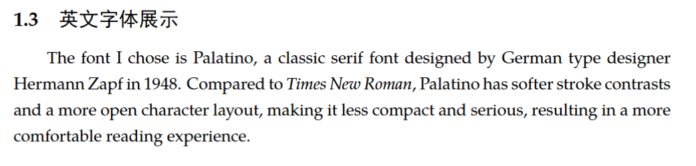
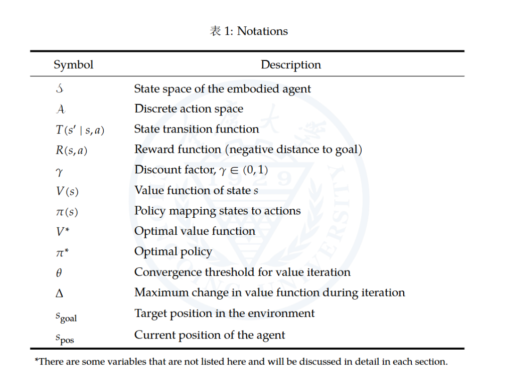
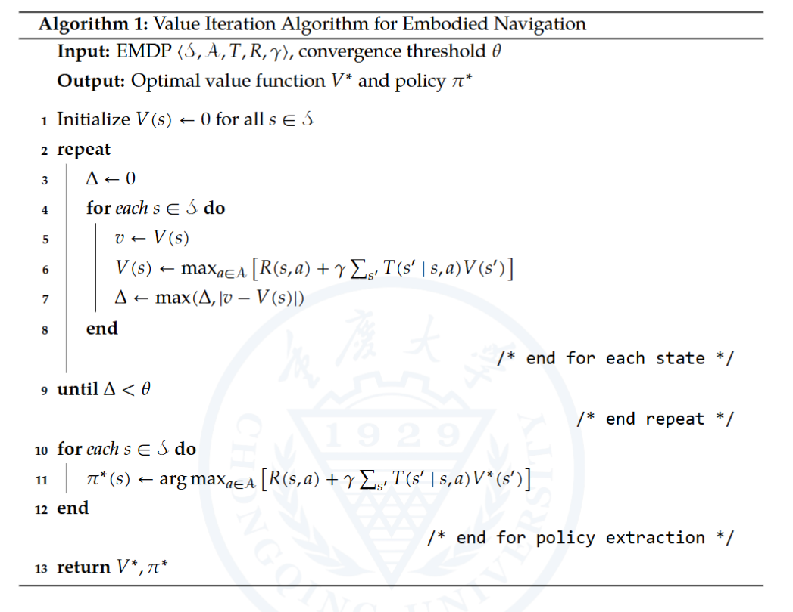
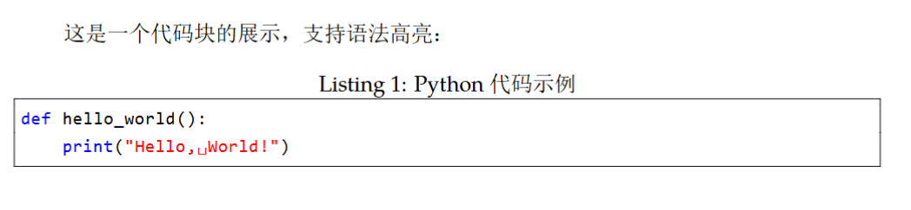
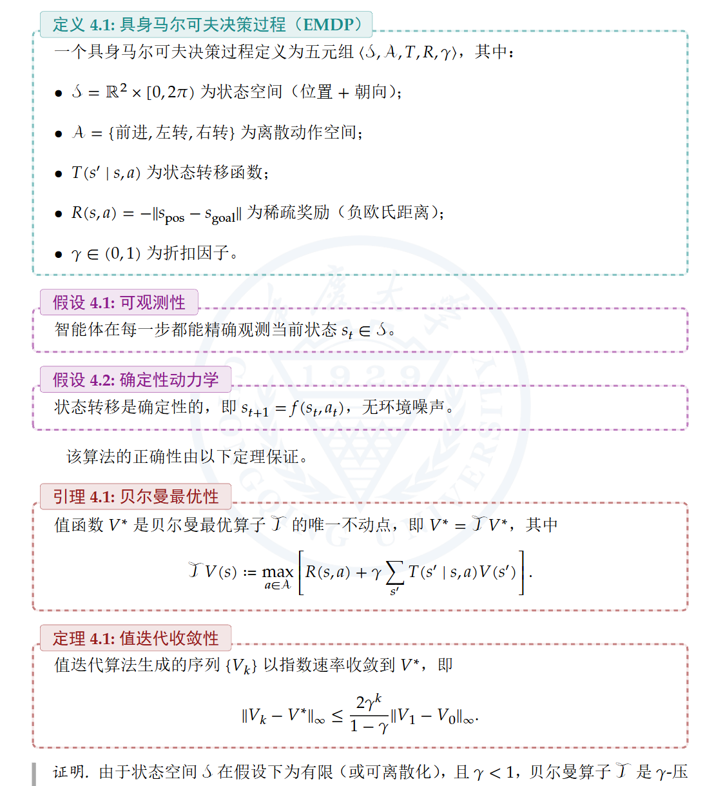

# 知识笔记 LaTeX 模板

本模板用于日常学习、知识积累、课程笔记、数理推导、算法整理和代码片段记录。

## 目录结构

```text
knowledge-note/
├── main.tex
├── main.pdf
├── config/
│   ├── packages.tex
│   ├── styles.tex
│   └── macros.tex
├── content/
│   ├── cover.tex
│   ├── chapter1.tex
│   ├── chapter2.tex
│   ├── chapter3.tex
│   ├── chapter4.tex
│   └── chapter5.tex
├── assets/
│   ├── figures/
│   └── logos/
└── bib/
    └── references.bib
```

## 使用方式

```bash
cd templates/knowledge-note
latexmk -xelatex main.tex
```

如果使用参考文献，请根据本地工具链情况运行 `biber` 或交给 `latexmk` 自动处理。

## 模板能力

- 中文与英文混排。
- Palatino 风格西文字体与数学字体。
- 三线表、伪代码、代码块。
- 定义、假设、定理、例子、证明等彩色信息框。
- 按章节拆分正文内容，便于长期维护。

## 效果展示

### 字体选择



### 三线表



### 伪代码



### 代码块



### 彩色信息框

| 类型 | 具体特征 | 色系 |
| --- | --- | --- |
| 定义 (Definition) | 基础、奠基、概念性 | 青色 |
| 假设 (Assumption) | 前提、约束、理想化 | 紫色 |
| 定理/引理/命题 (Theorem etc.) | 严谨、结论、核心成果 | 深红 |
| 例子 (Example) | 具体、说明、辅助 | 橙色 |
| 证明 (Proof) | 推导、过程、逻辑链 | 灰色 |


