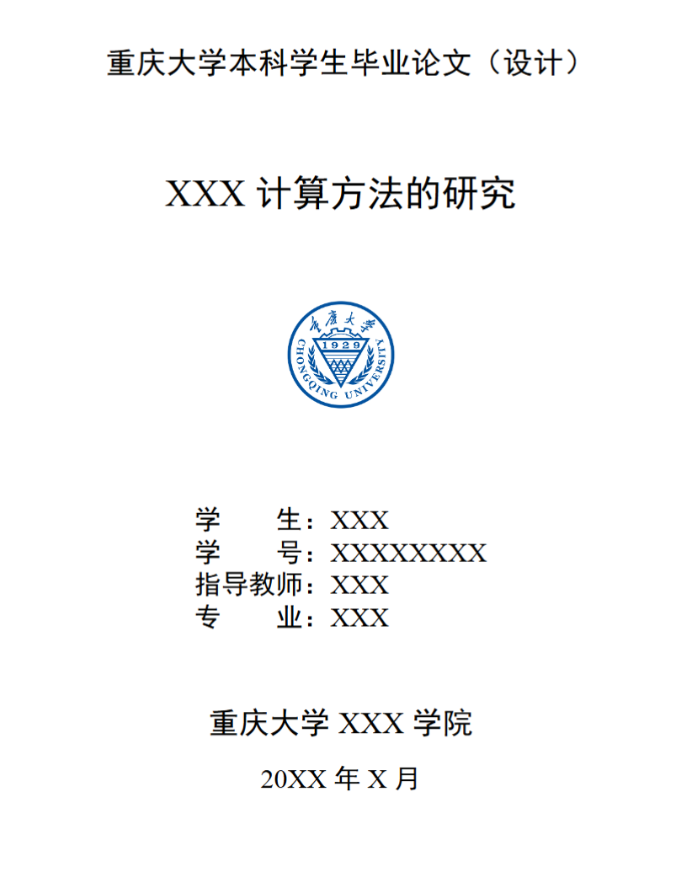
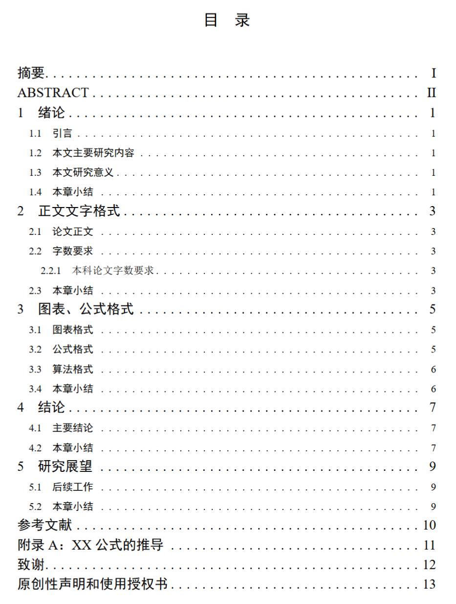
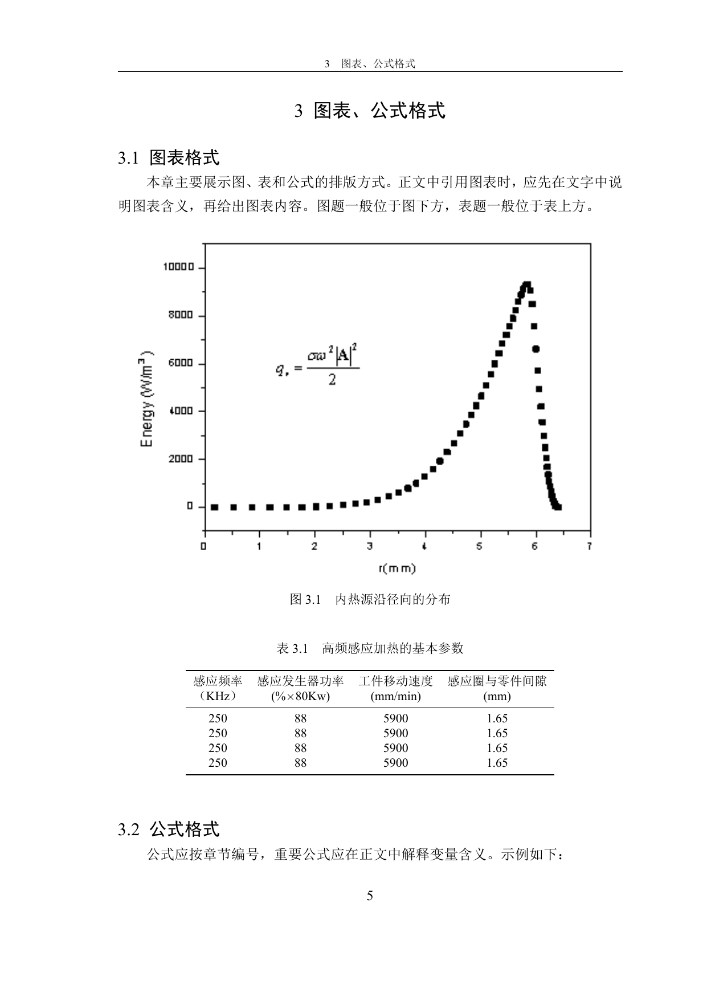
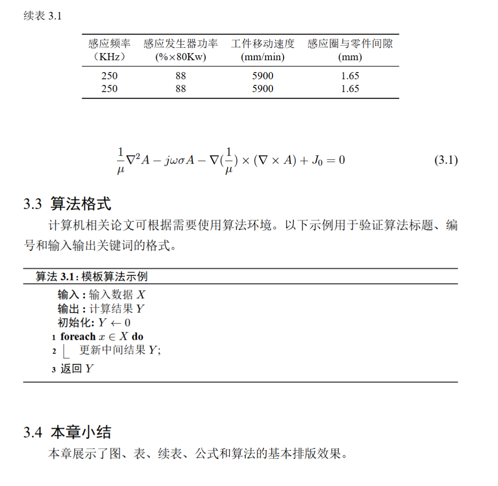

# 论文报告 LaTeX 模板

本模板用于课程论文、课程报告、毕业论文或其他正式写作场景。它基于 [CQULeaf/CQU_Undergraduate_Thesis_LaTeX_Template](https://github.com/CQULeaf/CQU_Undergraduate_Thesis_LaTeX_Template) 整理融入本仓库，保留重庆大学本科毕业论文（设计）模板的结构骨架，同时也便于裁剪成普通论文或课程报告。

## 目录结构

```text
thesis-report/
├── main.tex
├── main.pdf
├── config/
│   ├── packages.tex
│   └── styles.tex
├── content/
│   ├── cover.tex
│   ├── cover_en.tex
│   ├── abstract.tex
│   ├── abstract_en.tex
│   ├── toc.tex
│   ├── chapter1.tex
│   ├── chapter2.tex
│   ├── chapter3.tex
│   ├── chapter4.tex
│   ├── chapter5.tex
│   ├── references.tex
│   ├── appendix.tex
│   ├── acknowledgements.tex
│   └── declaration.tex
├── assets/
│   ├── figures/
│   └── logos/
└── bib/
    └── references.bib
```

## 使用方式

```bash
cd templates/thesis-report
latexmk -xelatex main.tex
```

若只用于课程论文或普通报告，可在 `main.tex` 中按需删去英文封面、英文摘要、附录、致谢和原创性声明等模块。

## 模板能力

- 正式论文工程结构：封面、摘要、目录、正文、参考文献、附录、致谢与声明分文件维护。
- 重庆大学风格基础：页眉、页脚、目录、章节标题、封面信息和正文行距集中配置。
- 图表与公式支持：按章节编号，包含图、表、续表、公式和算法示例。
- 参考文献支持：默认使用 `thebibliography`，也预留 `bib/references.bib` 便于后续切换。
- 可裁剪扩展：可保留完整毕设论文结构，也可精简为课程报告或阶段提交文档。

## 效果展示

### 封面



### 目录



### 图表、公式与算法





## 主要特色

### 模块化正文

`main.tex` 只负责加载顺序，正文内容集中在 `content/`。正式写作时，优先改对应内容文件；全局格式优先改 `config/`。

### 论文与报告双用途

完整保留毕业论文结构时，适合毕设论文和较正式的提交材料；删去部分前后置文件后，也可以快速变成课程论文、课程设计报告或项目结题报告。

### 集中格式控制

页面布局、字号、页眉页脚、目录和算法样式都集中在 `config/styles.tex` 与 `config/packages.tex`，避免在章节正文中反复手动设置格式。

## 来源说明

本模板基于 [CQULeaf/CQU_Undergraduate_Thesis_LaTeX_Template](https://github.com/CQULeaf/CQU_Undergraduate_Thesis_LaTeX_Template) 整理融入本仓库。
